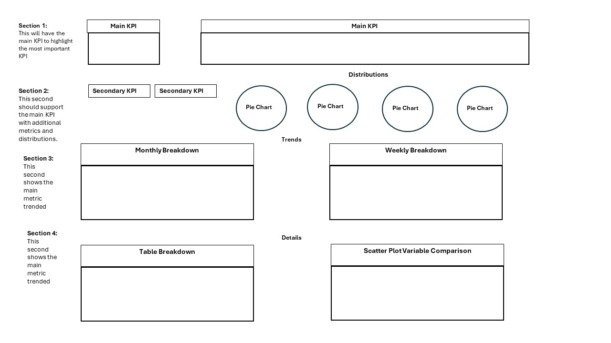
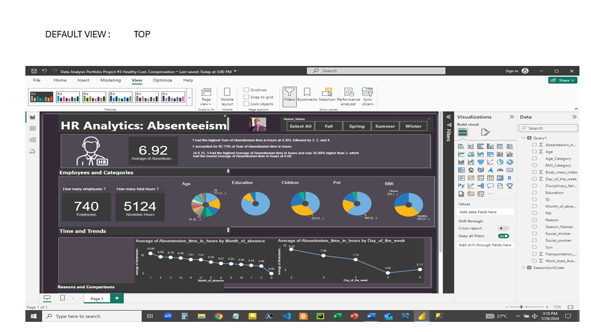
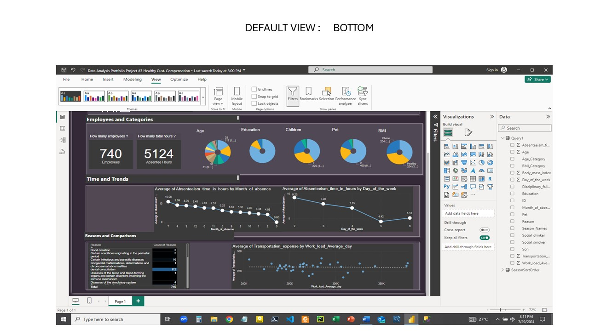
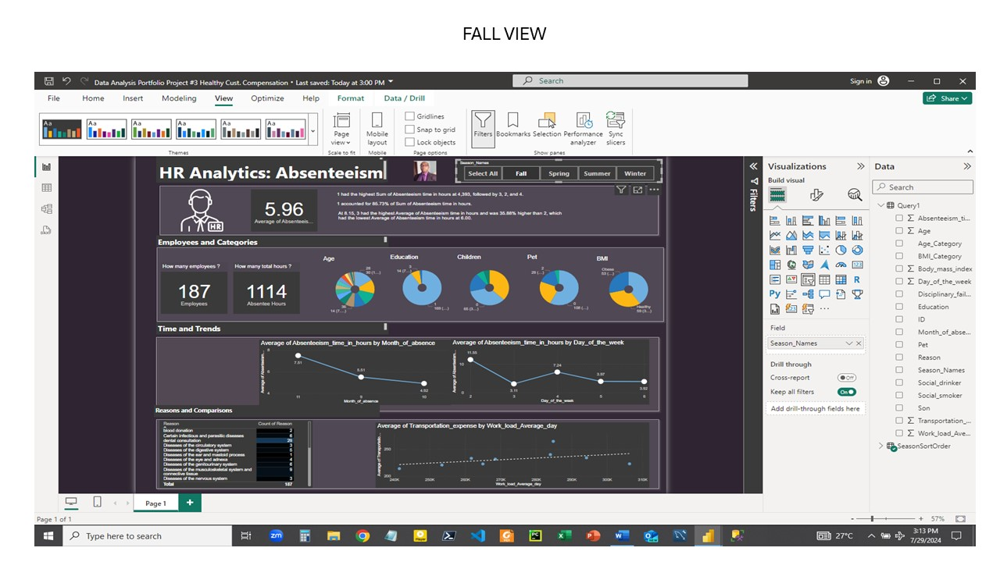
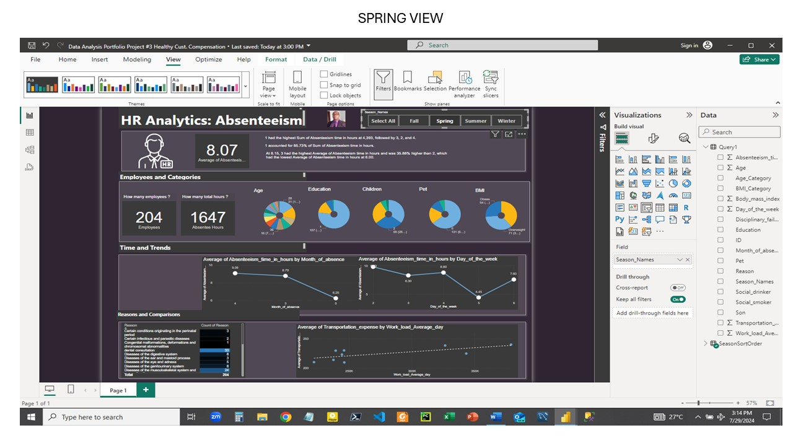
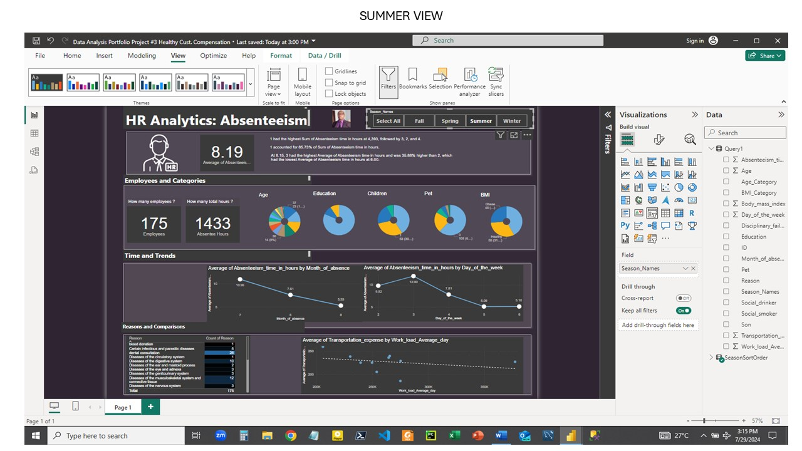

# Power-BI-Dashboard-Portfolio-Project-No-4
Power BI portfolio project for Healthy Staff Compensation.
# From Data to Health: Using Analytics to Drive Employee Incentives and Wellness

## Objective
This project aims to leverage data analytics to create an employee wellness program, providing insights into healthy individuals with low absenteeism, and calculating wage increases for non-smokers. The final deliverable is an interactive Power BI dashboard that helps HR understand absenteeism trends and make data-driven decisions.

## Data Analytics Portfolio Project (End-to-End)

### Data Analysis Tasks
- Build a Database
- Develop SQL Queries
- Perform Analysis
- Connect Database to Power BI
- Build a Dashboard (Wireframe)

### HR Requests
1. Healthy Bonus Program:
   - Identify healthy individuals with low absenteeism.
   - Allocate a total budget of $1000 USD for bonuses.

2. Non-Smokers Wage Increase:
   - Calculate wage increases for non-smokers within an insurance budget of $983.221 USD.

3. Absenteeism Dashboard:
   - Create a comprehensive dashboard based on an approved wireframe to visualize absenteeism data.
   
   
   ## Wireframes




## Step-by-Step Implementation in Power BI

1. Title and Filters
   - Title: "HR Analytics: Absenteeism"
   - Filters: Seasonal filters ("Select all," "Fall," "Spring," "Summer," and "Winter") using slicers on the top right.

2. Logo and Main KPI
   - Logo: HR logo below the title on the left.
   - Main KPI Card:
     - Field: Average of `Absenteeism_time_in_hours`
     - Title: "What is the main KPI?"
     - Value title: "Average of Absenteeism_time_in_hours"

3. Smart Narrative
   - Key points including:
     - Highest sum of absenteeism time by category.
     - Percentage contributions.
     - Comparisons of average absenteeism time.

4. Secondary KPIs
   - Card 1:
     - Title: "How many Employees?"
     - Value: 740
     - Subtitle: "Employees"
   - Card 2:
     - Title: "How many total Hours?"
     - Value: 5,124
     - Subtitle: "Absentee hours"

5. Distributions (Pie Charts)
   - Pie Chart 1: Legend and Values - Age
   - Pie Chart 2: Legend and Values - Education
   - Pie Chart 3: Legend and Values - Pets
   - Pie Chart 4: Legend and Values - Children
   - Pie Chart 5: Legend and Values - BMI

6. Trends and Time
   - Monthly Breakdown:
     - X-axis: `Month_of_absence`
     - Y-axis: Average of `Absenteeism_time_in_hours`
   - Weekly Breakdown:
     - X-axis: `Day_of_the_week`
     - Y-axis: Average of `Absenteeism_time_in_hours`

7. Reasons and Comparisons
   - Reasons Breakdown: Bar chart with reasons on the X-axis and percentages on the Y-axis.
   - Scatter Plot: `Work_load_Average_day` on the X-axis and `Transportation_expense` on the Y-axis.

8. Healthy Bonus and Wage Increase Calculations
   - Healthy Individuals with Low Absenteeism: Create a calculated column or measure to filter and allocate the $1000 budget.
   - Wage Increase for Non-Smokers: Filter dataset for non-smokers and calculate the distribution of the $983.221 insurance budget.

## Screenshots








## Installation

To clone the repository to your local machine, follow these steps:

1. Open your terminal or command prompt.
2. Navigate to the directory where you want to clone the repository:
   ```bash
   cd path/to/your/directory

